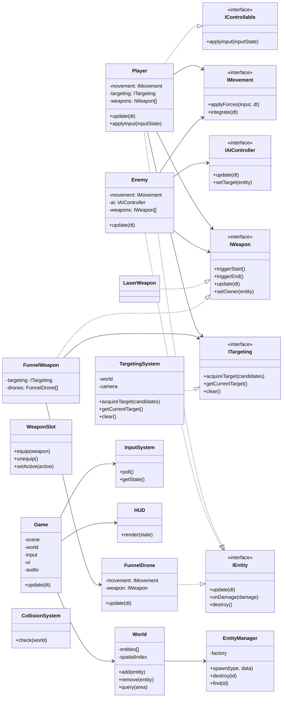
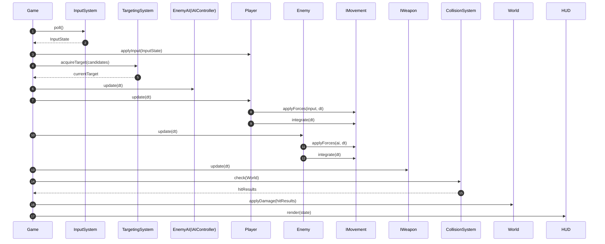
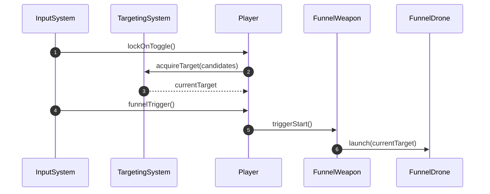
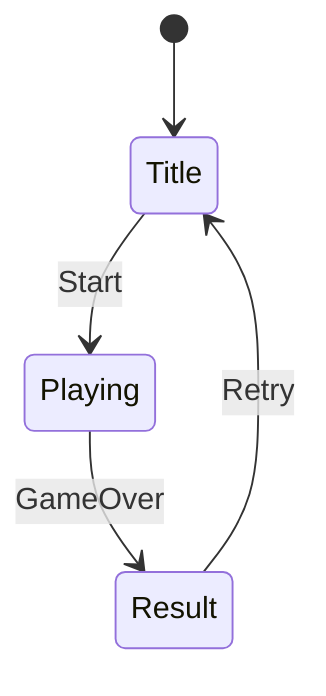
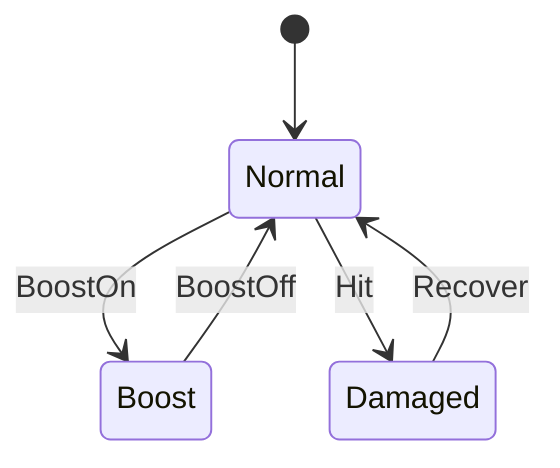
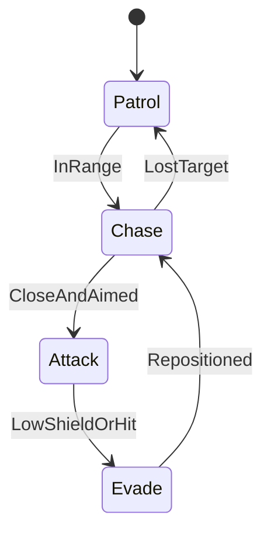

# 3D宇宙アクションゲーム 設計（単一ドキュメント）

このドキュメントは「ゲームとしての設計」を最優先し、実装に必要なアーキテクチャ/クラス/シーケンス/状態遷移を同一文書に統合したものです。

---

## 1. ゲーム設計（最優先仕様）

### 概要
リアルロボット風の機体が宇宙空間を自由に移動し、敵機を撃墜する3Dシューティング。Webブラウザで動作し、キーボード/マウスで操作する。

### ターゲット
- プラットフォーム: Web（Chrome/Edge/Firefox）
- 入力: キーボード + マウス
- 目標FPS: 60fps
- 単位系: メートル・秒・度（角度）

### コアコンセプト
- 6DoF（前後左右上下＋ピッチ/ヨー/ロール）の自由移動
- ブーストと慣性を活かした高速戦闘
- レーザーとファンネルの連携で撃墜

### ゲームループ（画面遷移）
1. スタート/リザルト画面
2. 出撃（ステージ開始）
3. 敵機撃墜（スコア加算）
4. 自機撃墜 → 残機-1 → 再出撃（残機0で終了）
5. リザルト表示

### 操作
- 移動: WASD（前後左右）、Space（上昇）、Shift（下降）
- 視点/機体の向き: マウス移動
- ロール: Q/E
- ブースト: V
- 主要武装（レーザー）: 左クリック
- サブ武装切替: B（ビーム/バズーカ）
- ファンネル: F
- ロックオン: R

### 視点
- 3人称追従カメラ（標準）
- 近距離被弾時は軽いカメラシェイク
- カメラ距離: 12m、高さ: 3m
- 追従スムージング: 0.12s
- シェイク強度: 0.35、持続: 0.28s

### 主要システム（機能要求）
- 物理/移動: 速度、加速度、慣性、最大速度、ブースト燃料
- 戦闘: レーザー（連射/ヒットスキャン）、ファンネル（ロックオン連動）
- ロックオン: Rキー、距離と視野角で取得
- 敵AI: パトロール/接近/射撃
- UI: HP/シールド、ブースト燃料、ロックオンインジケータ、簡易レーダー
- 演出: 被弾エフェクト、爆発、残光、BGM/SE

### ステージ
- 宇宙空間（星空、惑星、スペースデブリ）
- 障害物: 小惑星・残骸

### アセット方針
- 低ポリ/シンプルなメカでプロトタイプ
- 商用ライセンスを避け、オリジナルデザインを採用

### 技術選定
- エンジン: three.js
- 物理: 自前簡易物理
- ビルド: なし（静的HTML/ES Modules）

### 開発マイルストーン
1. プロトタイプ（6DoF移動、追従カメラ、簡易AI）
2. 戦闘実装（レーザー/ファンネル、ヒット判定）
3. UI/演出（HUD、エフェクト）
4. コンテンツ追加（ステージ、敵種類）

### 仕様確定（詳細）
#### ゲームルール
- 初期残機: 3
- クリア条件: 敵戦艦2隻の撃破
- 失敗条件: 味方戦艦の撃破 or 味方撃破回数が5回到達

#### 追加仕様（戦艦・味方AI・バズーカ）
- 敵戦艦2隻が初期配置され、一定間隔で敵機・デコイを射出する
- 味方戦艦2隻が初期配置され、一定間隔で味方AIを射出する
- 戦艦はビーム砲台を持ち、敵陣営のターゲットを狙って射撃する
- プレイヤーは敵戦艦2隻を破壊すると勝利
- 味方の戦艦が破壊されるか、味方死亡回数が5回に達すると敗北
- プレイヤーの追加武装: バズーカ（Bキーでビーム/バズーカ切替）
- バズーカは1回のクールタイム回復で5発まで発射可能
- 5発撃つとクールタイムへ移行（長めのリロード）

#### 移動/物理
- 最大速度: 80m/s
- 通常加速度: 40m/s^2
- ブースト倍率: 2.0（最大速度 160m/s）
- 旋回速度: ピッチ/ヨー 120°/s、ロール 160°/s
- ブースト燃料: 5.0s（連続使用）
- 燃料回復: ブースト停止後 1.0s で開始、10%/s
- 速度減衰: 無し（完全慣性）。ブレーキは `S` で逆加速

#### 戦闘/ロックオン
- レーザー: 連射 8発/秒、ダメージ10、射程500m、ヒットスキャン
- ファンネル: 3基、攻撃サイクル5回（0.45s間隔）、ダメージ6、クールダウン3.0s
- ロックオン: 取得距離300m、視野角30°、解除距離350m、優先度は中心角→距離

#### 耐久/ダメージ
- プレイヤーHP: 100
- シールド: 60
- シールド回復: 現状0（未実装）

#### 敵AI（状態遷移）
- Patrol → Chase: 距離 < 400m またはロックオン検知
- Chase → Attack: 距離 < 250m かつ視野角 < 20°
- Attack → Patrol: 距離 > 400m

#### 敵種類/出現パターン
- Grunt: HP 60 / シールド 30 / 4発/秒
- Ace: HP 120 / シールド 60 / 6発/秒、回避行動優先
- 敵機出現: 敵戦艦から一定間隔で射出
- 同時出現上限: 敵機/味方機/デコイはそれぞれ上限を持つ

#### UI/HUD
- ロックオン表示: 対象にリング + 距離表示
- レーダー: 半径 180m を2D表示（敵/味方/デコイ）

#### ステージ/障害物
- 戦闘空域: 半径 1000m の球形エリア
- 障害物数: 30（半径 8–30m）
- 生成範囲: 200–800m
- 衝突: 障害物は球コライダー

#### スコア
- 撃破スコア: Grunt 100 / Ace 250
- 連続撃破ボーナス: 10秒以内の連続撃破で +50
- クリアタイムボーナス: 未実装

#### パフォーマンス制約
- アクティブ弾数上限: 未実装
- ファンネル総数上限: 3
- 1フレームの衝突候補数: 300以内

---

## 2. プログラムアーキテクチャ（全面見直し）

### 設計方針
- コンポーネント指向 + データ駆動
- 依存は抽象へ向ける（DIP）
- ふるまい差し替えは `Strategy` / `State` で実現
- 生成は `Factory` / `Registry` を通す
- 疎結合は同期イベントバスで統一

### レイヤー
- Presentation: UI/HUD、入力
- Domain: ルール・戦闘・移動・AI
- Infrastructure: three.js、物理、リソース

### ゲームループ（更新順序）
1. Input収集
2. ターゲット更新
3. AI更新
4. 移動/物理統合
5. 武器更新/発射
6. 衝突判定
7. ダメージ適用/破壊
8. 描画
9. UI更新

※更新起点は `Game`。`Game` が `World` と各 `System` を順序通りに呼び出す。
`World` はエンティティ集合と空間インデックスを保持し、`System` は `World` に対して読み書きする。

### 依存方向
- `Game` → `System` → `World`
- `Entity` → 抽象（`IMovement`/`IWeapon`/`ITargeting`/`IAIController`）
- `Infrastructure` は最下層として `Domain` から参照される

### 主要インターフェース
#### `IEntity`
- `update(dt)`
- `onDamage(damage)`
- `destroy()`

#### `IControllable`
- `applyInput(inputState)`

#### `IMovement`
- `applyForces(input, dt)`
- `integrate(dt)`

#### `IWeapon`
- `triggerStart()` / `triggerEnd()`
- `update(dt)`
- `setOwner(entity)`

#### `ITargeting`
- `acquireTarget(candidates)`
- `getCurrentTarget()`
- `clear()`

#### `IAIController`
- `update(dt)`
- `setTarget(entity)`

### コアクラス
#### `Game`
- 役割: ゲーム進行管理
- 所持: `Scene` / `World` / `InputSystem` / `UI` / `Audio`
- 更新起点: すべての `System` 更新は `Game` が呼び出す

#### `World`
- 役割: 空間とエンティティ管理
- 所持: `entities[]`, `spatialIndex`
- 所有権: エンティティの生存管理（生成/破壊は `EntityManager` 経由）

#### `EntityManager`
- 役割: 生成/破壊/検索
- 依存: `EntityFactory`
- 所有権: 生成と破棄の受付、`World` への登録/解除を実行

#### `Player`（`IEntity`, `IControllable`）
- 役割: 自機
- 依存: `IMovement`, `ITargeting`, `IWeapon[]`

#### `Enemy`（`IEntity`）
- 役割: 敵機基底
- 依存: `IMovement`, `IAIController`, `IWeapon[]`

#### `WeaponSlot`
- 役割: 武装の着脱/有効化

#### `LaserWeapon`（`IWeapon`）
- 役割: ヒットスキャンレーザー

#### `FunnelWeapon`（`IWeapon`）
- 役割: ロックオン対象へファンネル攻撃
- 依存: `ITargeting`, `FunnelDrone[]`

#### `FunnelDrone`（`IEntity`）
- 役割: 個別ファンネル
- 依存: `IMovement`, `IWeapon`（内蔵ビーム）

#### `TargetingSystem`（`ITargeting`）
- 役割: ロックオン取得
- 依存: `World`, `Camera`

#### `InputSystem`
- 役割: 入力収集
- 出力: `InputState`（移動/射撃/ロックオン/ファンネル）

#### `CollisionSystem`
- 役割: 衝突判定

#### `HUD`
- 役割: HP/シールド/ロックオン表示

### イベントバス仕様
- 方式: 同期イベント（同一フレーム内で即時ディスパッチ）
- 順序: 登録順。`Game` の更新順序を跨いでのディスパッチは禁止（同一 `System` 内で完結）
- 用途: UI通知、効果音/エフェクト、実績/ログ
- 代表イベント:
  - `DamageApplied { sourceId, targetId, amount, isShield }`
  - `EntityDestroyed { entityId, reason }`
  - `LockOnAcquired { ownerId, targetId }`
  - `WeaponFired { ownerId, weaponId }`

### データ駆動仕様
- 現状: JS定数（src/config/gameConfig.js）
- 将来: JSON化 + schemaVersion + スキーマ検証 + ホットリロード

---

## 3. 実装メモ（2026-02-08）

### 戦艦/スポーン
- Battleship エンティティを追加し、敵2隻・味方2隻を初期配置
- 敵戦艦: プレイヤーをターゲット、ビームは命中精度を大幅に低下
- 味方戦艦: 近い敵（敵戦艦/敵機）をターゲット
- 敵戦艦から敵機/デコイ、味方戦艦から味方AIを定期射出
- 初期敵/デコイの直接スポーンは停止

### 味方AI
- 味方AIは AllyAI で最寄りの敵を探索して戦闘
- 味方の撃破は allyDeaths として集計

### 武装
- プレイヤーにバズーカを追加
- Bキーでビーム/バズーカ切替（同一トリガー）
- バズーカは5発撃つと長めのクールダウンに入る

### 勝敗条件
- 勝利: 敵戦艦2隻の撃破
- 敗北: 味方戦艦の撃破 or 味方撃破回数が5回到達

### 実装ファイル
- Battleship: src/entities/Battleship.js
- 味方AI: src/ai/AllyAI.js
- バズーカ: src/weapons/BazookaWeapon.js
- スポーン/勝敗/切替: src/main.js
- HUD拡張: src/ui/HUD.js

### 時間管理/物理
- タイムステップ: 固定 1/60 秒。`Game` がアキュムレータで積分し、`dt` は最大 1/15 にクランプ
- 積分: Semi-Implicit Euler
- 速度上限: `IMovement` で速度ベクトルのノルムをクランプ

### 衝突/空間分割
- 形状: 自機/敵機/ファンネルは球、障害物は球/カプセル
- 空間分割: 固定グリッド（セルサイズ 50m）
- 目的: 60fps維持のため当たり判定候補をセル内に限定

### 拡張例
- 新武装: `IWeapon` 実装を追加し `WeaponSlot` に装着
- 新敵AI: `IAIController` 実装を追加
- 新移動方式: `IMovement` 実装を追加

### 推奨ファイル構成
- src/core
  - Game.ts, World.ts, EntityManager.ts
- src/entities
  - Player.ts, Enemy.ts, FunnelDrone.ts
- src/systems
  - InputSystem.ts, TargetingSystem.ts, CollisionSystem.ts
- src/weapons
  - LaserWeapon.ts, FunnelWeapon.ts
- src/ai
  - EnemyAI.ts
- src/movement
  - SixDoFMovement.ts
- src/ui
  - HUD.ts

---

## 3. クラス図（Mermaid）

---

## 4. シーケンス設計（Mermaid）

### 4.1 フレーム更新シーケンス

### 4.2 ロックオン・ファンネル起動シーケンス

---

## 5. 状態遷移設計（Mermaid）

### 5.1 画面遷移

### 5.2 プレイヤー状態

### 5.3 敵AI状態

---

## 6. 仕様整合メモ（実装との差分管理）

この設計を実装へ落とし込む際、以下の差分は必ず統合ルールを決める。
- 入力マッピング（ブーストキー等）
- 慣性/減速の扱い
- カメラ距離/スムージング

---

## 7. 移行ロードマップ（設計→実装）

1. `Game`/`World`/`System` の骨格を追加
2. 入力・移動を新ループに移植
3. ターゲット/武器/衝突の順に追加
4. UI/HUD とイベントバス連携
